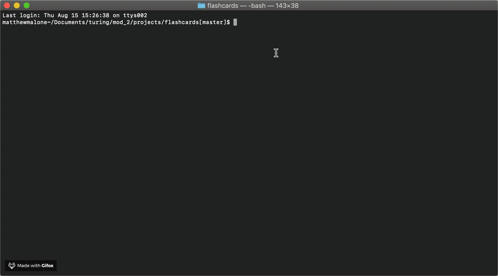

# FlashCards - Web Dev Edition

## Abstract

I am a student at Turing School of Software and Design, whom provioded the project specifications. This project focused on Test Driven Development where we would write tests then code to pass the test.



## Wanna Play?

Clone down repo (from your GitHub) here[https://github.com/matthewdshepherd/flashcards-starter]. 

In your terminal cd into a comfortable spot, like a file in documents. for there:

```bash
git clone https://github.com/matthewdshepherd/flashcards-starter.git
```
Once you have cloned the repo, change into the directory. 

**Are you ready for some serious fun about things you might know nothing about?**

Throw in `node index.js` in the command line, **hit enter**, and your game should start!